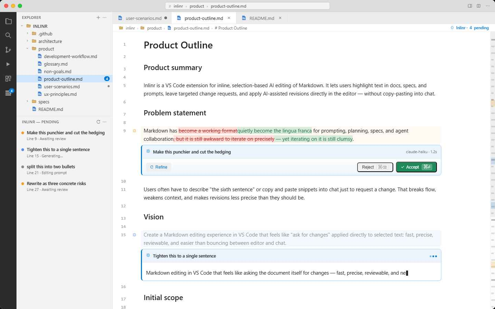

# Inlinr

Inlinr is a preview VS Code extension for inline, selection-based AI editing of Markdown. It lets you highlight text in docs, specs, and prompts, ask for a targeted revision, review the proposed change in context, and apply it directly in the editor without detouring into chat.

## Features

- Select Markdown and open a request directly from the targeted text.
- Keep AI edits scoped to the selected passage instead of the whole document.
- Review the suggested change inline before applying it.
- Preserve Markdown structure and surrounding context where possible.
- Iterate quickly on prompts, specs, and working docs without copy-paste.

## Preview

Inlinr is currently in preview. The selection-scoped editing workflow is functional, but the experience is still evolving and some behaviors may change as the inline review flow is refined.

### Marketplace screenshot

## Requirements

- VS Code `1.90.0` or newer
- Access to a Copilot-backed chat model through the VS Code Language Model API

If a supported model is unavailable or access is denied, Inlinr keeps the request flow available for capture and review state management but will not execute the rewrite request.

## Using Inlinr

1. Open a Markdown document in VS Code.
2. Select the passage you want to revise.
3. Trigger the inline editing flow from the selected text.
4. Review the proposed change in context before applying it.
