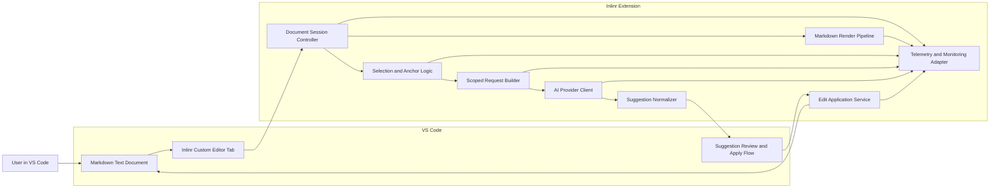

# High-Level Architecture

## MVP stack direction

- **Editor platform:** VS Code extension
- **Primary surface:** Inlinr custom Markdown editor hosted in the current editor tab
- **Initial document experience:** Render Markdown locally as preview-only content inside the Inlinr surface
- **AI layer:** Inlinr-owned request capture plus a provider client behind supported VS Code extension APIs, with the VS Code Language Model API as the default invocation boundary for scoped editing
- **Edit application:** diff or replacement flow that updates only the intended document region

See `architecture/adr-001-custom-markdown-editor-surface.md` for the decision to use a custom editor
surface as the foundation for both the initial viewer and later inline editing flows. See
`architecture/adr-002-inlinr-owned-request-capture-and-model-invocation.md` for the decision to keep
request capture and model invocation under Inlinr control rather than automating another chat UI. See
`architecture/adr-004-local-mermaid-rendering-in-markdown-viewer.md` for the decision to keep Mermaid
diagram rendering local to the Markdown viewer boundary. See
`architecture/adr-005-repo-owned-monitoring-alert-management.md` for the decision to manage Azure
monitoring alerts as repo-owned declarative infrastructure deployed by workflows rather than as
manual portal state.

## Current component diagram

## Core components

| Component | Responsibility |
|---|---|
| Markdown Text Document | Holds the user-authored source text and remains the canonical document model. |
| Inlinr Custom Editor Tab | Replaces the default Markdown editor surface for Inlinr-controlled document opens. |
| Document Session Controller | Coordinates a text document, its visible Inlinr editor instance, refresh, and future editing state. |
| Markdown Render Pipeline | Converts Markdown text into locally rendered preview content for the custom editor webview, including local Mermaid diagram handling. |
| Selection and Anchor Logic | Tracks what text the request targets and keeps that intent stable as edits happen. |
| Anchored Request Popup | Webview-owned transient overlay that appears near the live selection and keeps request entry inside the Inlinr surface while the extension host validates source-backed targeting. |
| Scoped Request Builder | Packages the selected text and nearby context for an AI edit request. |
| AI Provider Client | Calls the configured model backend through supported VS Code extension APIs rather than another extension's chat UI. |
| Suggestion Normalizer | Converts provider output into a predictable suggested edit shape. |
| Suggestion Review and Apply Flow | Shows the proposed change and lets the user accept, reject, or refine it. |
| Edit Application Service | Applies the approved edit to the intended range in the document. |
| Telemetry and Monitoring Adapter | Emits sanitized scenario, checkpoint, dependency, and failure telemetry for monitoring and alerting without exposing document content. |

## Architecture principles

- Keep the document surface under Inlinr control so viewing and later editing share one editor model.
- Keep the editing loop precise and selection-scoped.
- Keep transient overlay state in the webview and keep source-backed validation in the extension host.
- Keep provider details behind a stable contract.
- Keep telemetry scenario-based, sanitized, and emitted from the extension-host boundary.
- Keep monitoring alert configuration repo-owned and workflow-deployed rather than manually managed in Azure.
- Prefer extension-owned UI and supported APIs over automating other extension surfaces.
- Preserve document integrity and user trust.
- Favor simple local extension flows before adding background orchestration.

## Current architecture gaps and backlog

| Gap | Why it matters | Likely next move |
|---|---|---|
| No explicit custom editor shell | The initial viewer needs a durable document surface that can later host editing. | Add the custom editor, document-session controller, and local render pipeline described in ADR 001. |
| No durable anchoring strategy | Requests can become ambiguous as documents change. | Add a stable anchor model that can re-find intended text or fail clearly. |
| No prompt harness system of record | Editing behavior can drift if request construction lives only in code. | Add a prompt and instruction layer with versioned editing templates. |
| No evaluation harness | AI changes will be hard to compare and regressions will be easy to miss. | Add a small corpus of Markdown editing fixtures and expected outcomes. |
| No explicit provider policy | Cost, latency, and quality tradeoffs will otherwise stay implicit. | Define default model choice, escalation rules, and timeout behavior. |
| No persisted comment model | Some UX flows may eventually need state beyond one request. | Decide whether comments and request history stay ephemeral or become saved workspace data. |
