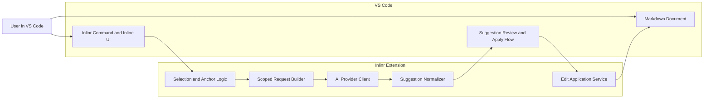

# High-Level Architecture

## MVP stack direction

- **Editor platform:** VS Code extension
- **Primary surface:** Markdown editor selections, inline commands, and review UI
- **AI layer:** provider client plus a thin request/response harness for scoped editing
- **Edit application:** diff or replacement flow that updates only the intended document region

## Current component diagram

## Core components

| Component | Responsibility |
|---|---|
| Markdown Document | Holds the user-authored source text. |
| Inlinr Command and Inline UI | Starts requests from the current selection and presents actions. |
| Selection and Anchor Logic | Tracks what text the request targets and keeps that intent stable as edits happen. |
| Scoped Request Builder | Packages the selected text and nearby context for an AI edit request. |
| AI Provider Client | Calls the configured model backend. |
| Suggestion Normalizer | Converts provider output into a predictable suggested edit shape. |
| Suggestion Review and Apply Flow | Shows the proposed change and lets the user accept, reject, or refine it. |
| Edit Application Service | Applies the approved edit to the intended range in the document. |

## Architecture principles

- Keep the editing loop precise and selection-scoped.
- Keep provider details behind a stable contract.
- Preserve document integrity and user trust.
- Favor simple local extension flows before adding background orchestration.

## Current architecture gaps and backlog

| Gap | Why it matters | Likely next move |
|---|---|---|
| No durable anchoring strategy | Requests can become ambiguous as documents change. | Add a stable anchor model that can re-find intended text or fail clearly. |
| No prompt harness system of record | Editing behavior can drift if request construction lives only in code. | Add a prompt and instruction layer with versioned editing templates. |
| No evaluation harness | AI changes will be hard to compare and regressions will be easy to miss. | Add a small corpus of Markdown editing fixtures and expected outcomes. |
| No explicit provider policy | Cost, latency, and quality tradeoffs will otherwise stay implicit. | Define default model choice, escalation rules, and timeout behavior. |
| No persisted comment model | Some UX flows may eventually need state beyond one request. | Decide whether comments and request history stay ephemeral or become saved workspace data. |
